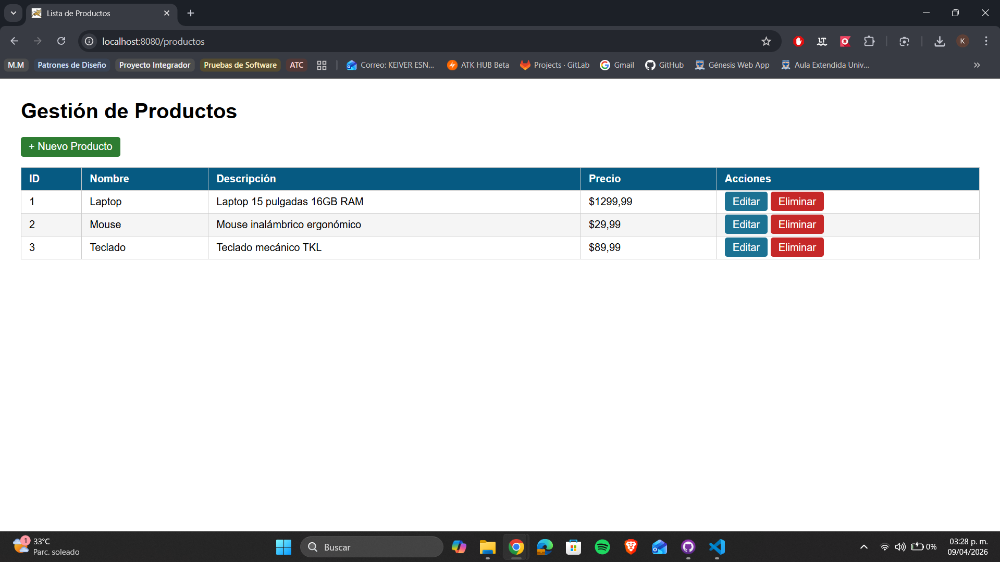
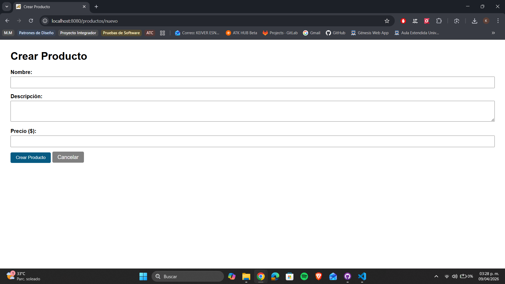
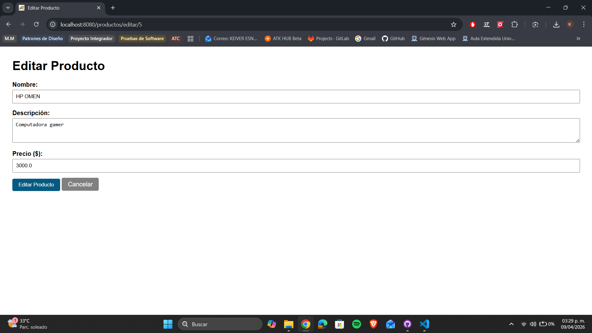
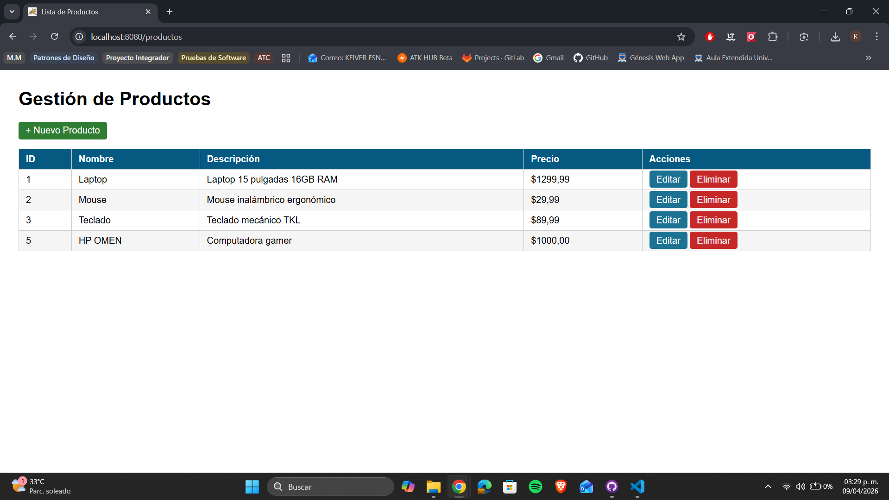

# Gestión de Productos con Spring Boot y Thymeleaf — Post-Contenido 1 Unidad 7

> **Post-Contenido 1 — Unidad 7**

Aplicación web CRUD completa de gestión de productos desarrollada con Spring Boot y Thymeleaf como motor de plantillas. Implementa el patrón MVC con una lista en memoria como capa de persistencia temporal y el patrón Post/Redirect/Get para el procesamiento de formularios.

## Tecnologías utilizadas

- **Java 21**
- **Spring Boot 3.5.1**
- **Thymeleaf**
- **Spring Boot DevTools**
- **Maven 3.9.12**

## Estructura del proyecto

```text
productos-web/
└── src/
    ├── main/
    │   ├── java/com/universidad/productos_web/
    │   │   ├── ProductosWebApplication.java
    │   │   ├── model/
    │   │   │   └── Producto.java
    │   │   ├── service/
    │   │   │   └── ProductoService.java
    │   │   └── controller/
    │   │       └── ProductoController.java
    │   └── resources/
    │       ├── application.properties
    │       └── templates/
    │           └── productos/
    │               ├── lista.html
    │               └── formulario.html
    └── test/
```

## Requisitos previos

- **Java 17** o superior
- **Maven 3.8+**

## Instrucciones de ejecución

1. **Clonar el repositorio**

```bash
   git clone https://github.com/tu-usuario/castellanos-post1-u7.git
   cd castellanos-post1-u7/productos-web
```

2. **Ejecutar la aplicación**

```bash
   mvn spring-boot:run
```

3. **Acceder a la aplicación**

   [http://localhost:8080/productos](http://localhost:8080/productos)

## Funcionalidades implementadas

- **Listar productos:** muestra todos los productos en una tabla
- **Crear producto:** formulario vacío con validación HTML5
- **Editar producto:** formulario prellenado con los datos del producto
- **Eliminar producto:** confirmación antes de eliminar
- **Patrón PRG:** redirige después de cada POST para evitar reenvío de formularios
- **Servidor embebido:** no requiere Tomcat externo, Spring Boot lo incluye

## Diferencias con Unidad 6 (Servlets/JSP)

| Aspecto     | Unidad 6 (Servlets/JSP) | Unidad 7 (Spring Boot)            |
| ----------- | ----------------------- | --------------------------------- |
| Servidor    | Tomcat externo          | Embebido en la app                |
| Vistas      | JSP + JSTL              | Thymeleaf (HTML)                  |
| Controlador | `@WebServlet`           | `@Controller` + `@RequestMapping` |
| Despliegue  | Copiar WAR              | `mvn spring-boot:run`             |

## Capturas de pantalla

### Lista de productos



### Formulario de nuevo producto



### Formulario de edición



### Lista actualizada


